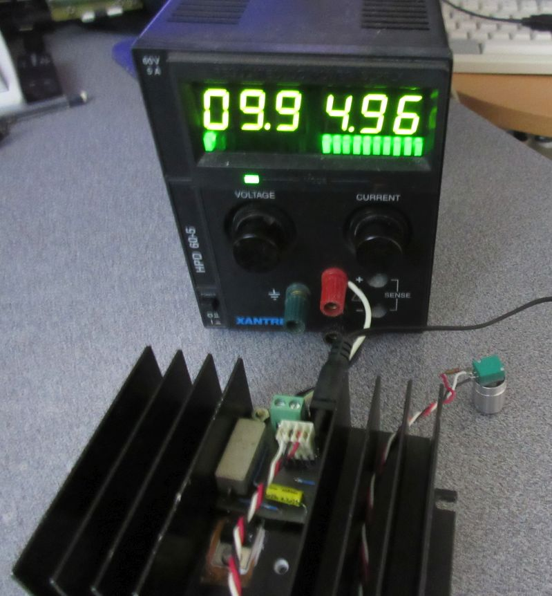
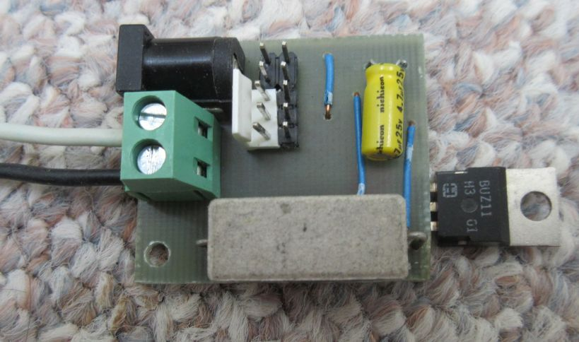
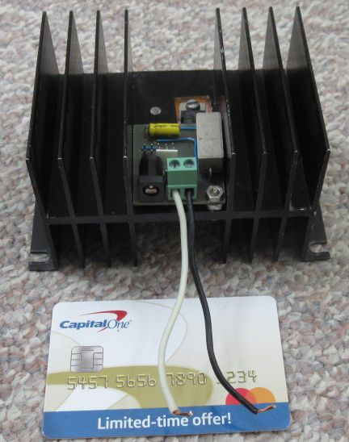

## Current Current Load
This is a constant current load useful for a maximum of 50V or 5A or 50W. The opamp circuit is powered by an external 12V DC supply.

The output current can be set by a 0-0.5V control signal.  The 0.1R 5W power resistor is used with an opamp feedabck loop.

A low Temperature coefficient sensing resistor with a noninverting amplifier is used for reading the current. It is roughly 0.5V/A intended for a 3.3V microcontroller.  The output gain can be changed by varying R6.

The circuit is constructed on a single side PCB with a mix of SMT and through hole components.  The 10-pin connector is used for controlling and sensing the output.

The PCB is mounted onto a 50W heatsink.

License: 

Hardware - CC-BY 4.0

