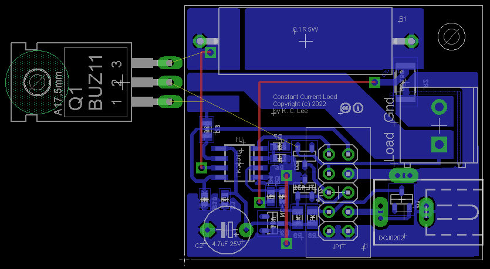
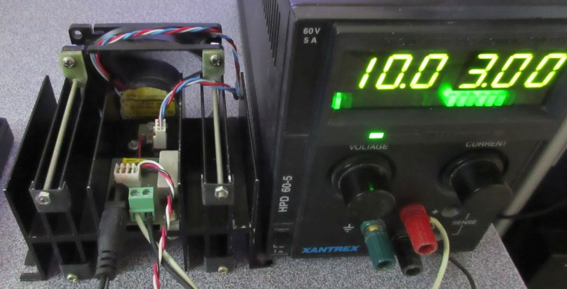
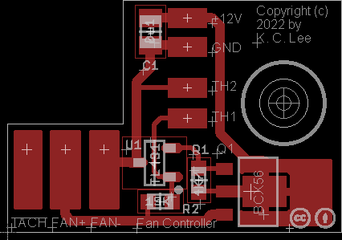
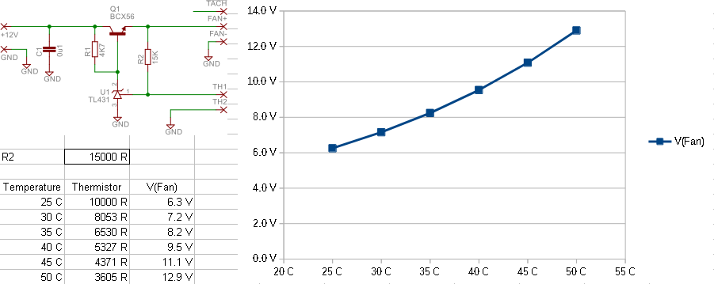
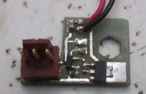
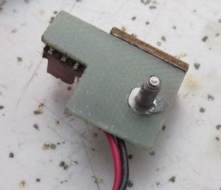
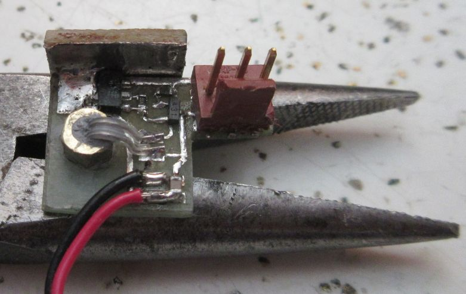

## Current Current Load
This is a constant current load useful for a maximum of 50V or 5A or 30W under forced air cooling. A MOSFET with a better package and improve cooling could improve on the upper power limit.

The opamp circuit is powered by an external 12V DC supply. The output current can be set by a 0-0.5V control signal.  The 0.1R 5W power resistor is used with an opamp feedabck loop.

The circuit is constructed on a single side PCB with a mix of SMT and through hole components.  The 10-pin connector is used for controlling and sensing the output.

A low Temperature coefficient sensing resistor with a noninverting amplifier is used for reading the current. It is roughly 0.5V/A intended for a 3.3V microcontroller.  The output gain can be changed by varying R6.

The PCB is mounted onto a 50W heatsink with MOSFET and a fan with a speed controller.

## Fan speed controller

I have a large bag of 10K thermistors (NTC MF52AT B3950) from aliexpress. The resistance vs temperature is similar to [Fenwal 10K Curve 16](http://techlib.com/electronics/thermistor_data.htm) 

The fan speed controller is a simple linear regulator with a thermistor and a resistor dividor for the voltage feedback. The fan reaches full speed around 45C. The 15K needs to be adjust for a thermistor Beta values other than 3950.

V(fan) = 2.5V * (Rth + 15K)/Rth.

I really needed a stud mounted part (3D printers) to sense the heatsink temperature, so I made my own.

I filed a hexagon hole in the PCB for a 4-40 hex jackscrew (commonly used for D-sub connectors).

The jackscrew is press fit (or hammered in my case) onto the PCB. The controller PCB is mounted flush onto the heatsink with the base of the stud making good thermal contact. 

I dipped the thermistor in thermal paste and fits into the screw hole. Hot gule or epoxy can then be applied to cover the sensor.  A small piece of PCB (~1cm^2) acts as the heatsink for the transistor.

License: 

Hardware - CC-BY 4.0

